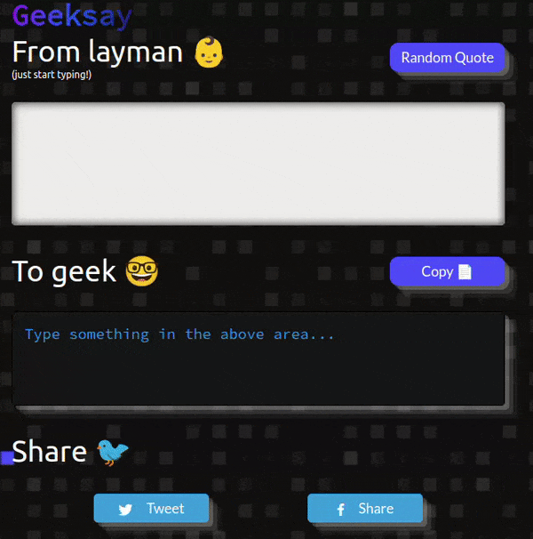
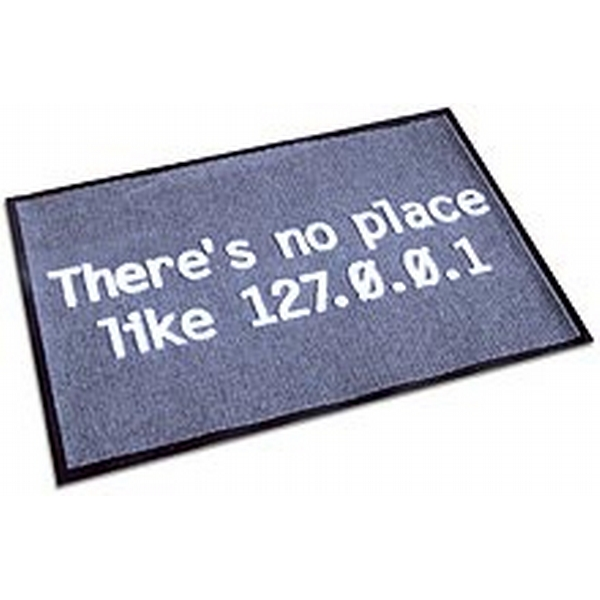

# geeksay 

> geeks will ctrl+s the world

> There's no place like 127.0.0.1

> sometimes, i just need a ` `

You know how sometimes you find these really geeky quotes and wish the world had more of them? Yeah, geeksay fixes that. Try it out at [http://geeksay.xyz](http://geeksay.xyz)

## Demo

This is what you actually want, right? Right?? [There you go!](http://geeksay.xyz) 👏

## Contributing

The core of this project is the [geeksay.js](https://github.com/swapagarwal/geeksay/blob/master/geeksay.js) file. Contributions are welcome! 😇

> If you'd like to quickly send some geeky words (e.g. home -> 127.0.0.1) without using GitHub, you can submit them via this [form](https://goo.gl/forms/LcJkSgghhm68Ajvc2) or in this [sheet](https://docs.google.com/spreadsheets/d/166ExyRTa6PmtRfONKsaICiaUDTLgATCVQ0K5fMtJuW8/edit?usp=sharing).

- For a small change, just send a PR.
- For bigger changes, open an issue for discussion before sending a PR.
- PR should include an example, if it makes sense.
- You can also contribute by:
  - Reporting issues
  - Suggesting new features or enhancements

